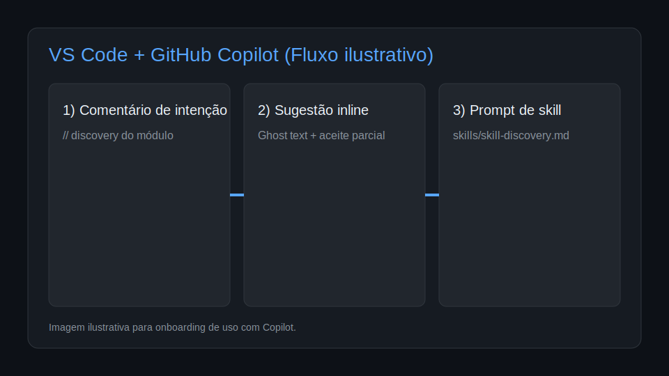
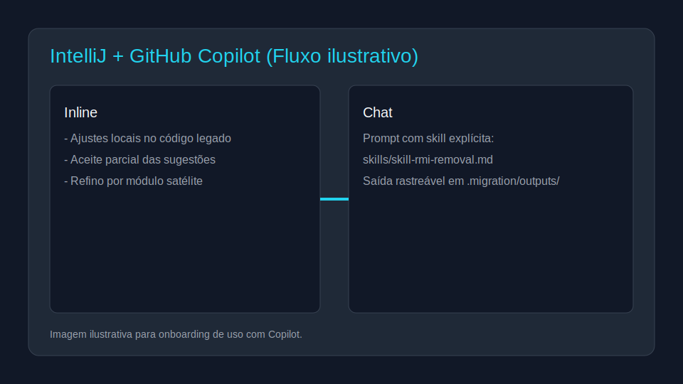
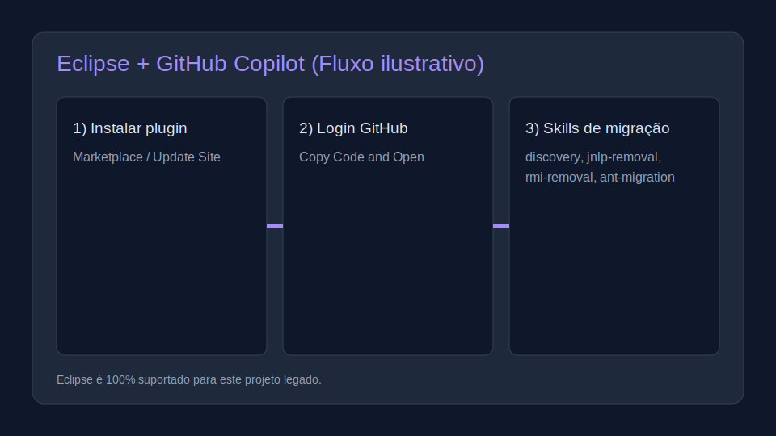

# migration-squads

Repositório central para **orquestração de migração de Java legado** com foco em cenários como:
- remoção de **RMI**;
- remoção de **JNLP/Java Web Start**;
- remoção de integrações **SOAP/Web Services**;
- modernização de build **ANT**;
- evolução contínua para novas frentes (upgrade de dependências, migração de transações proprietárias para Spring + Hibernate, etc.).

A proposta é funcionar como um **orquestrador mestre de skills e agentes**, reutilizável entre múltiplos projetos satélites (ex.: `atendimento`, `empresa`, `common`, `infra`, etc.), reduzindo retrabalho e padronizando execução.

## O que existe neste repositório

- **Orquestrador central**: `.github/copilot-instructions.md`
- **Prompt mestre**: `prompts/master-prompt.md`
- **Agentes por papel**: `agents/`
- **Skills reutilizáveis**: `skills/`
- **Template para novas skills**: `skills/TEMPLATE-new-skill.md`
- **Modelo de integração local**: `.migration/`

## Agentes especialistas por tecnologia legada

Este repositório não usa mais um agente genérico de desenvolvimento backend para remoções legadas. A squad técnica é especializada por tecnologia:

- `agents/dev-jnlp.md`
- `agents/dev-rmi.md`
- `agents/dev-soap.md`

Cada agente deve:
- executar análise aprofundada e rastreável;
- evitar remoção apressada/destrutiva;
- permitir remoção total sem substituição quando não houver dependências vivas fora do contexto removido;
- preservar/adaptar artefatos compartilhados com uso ativo (ex.: DTO/utilitário) para não quebrar fluxos mantidos;
- escalar ao `agents/product-owner.md` com opções e impactos somente quando houver incerteza de uso ativo/cross-flow.

## Definição-chave: uso ativo

Neste contexto, "uso ativo" significa referência ainda utilizada por funcionalidade mantida (ex.: chamada em runtime, API/tela em produção, job ativo ou dependência de módulo satélite em operação).
Não é considerado uso ativo: código comentado, endpoint descontinuado sem chamadas reais, referência histórica em documentação ou artefato legado sem execução no fluxo atual.

## Como usar a infraestrutura (modelo híbrido recomendado)

### 1) Infra central (este repositório)
Use este repositório para manter:
- padrões de execução;
- protocolo de agentes;
- skills genéricas de migração;
- governança e evolução da squad.

### 2) Adaptação local (em cada projeto consumidor)
Em cada projeto legado/satélite, crie e adapte o diretório `.migration/` com:
- `settings.local.json` (a partir de `.migration/settings.local.example.json`);
- `bridges/` para adaptar diferenças de tabela, colunas, paths e exceções;
- `outputs/` para evidências (discovery, SQL, plano, checklist).

> Segurança: não versionar credenciais. Use variável de ambiente (`database.passwordEnv`) e garanta no `.gitignore` do projeto consumidor:
> - `.migration/settings.local.json`
> - Exemplo: manter `"passwordEnv": "PGPASSWORD"` no `settings.local.json` e carregar `PGPASSWORD` por mecanismo seguro (secret manager/arquivo local não versionado). **Não** defina senha diretamente por `export ...` digitado no terminal para não vazar em histórico.

## Fluxo básico de orquestração das skills (passo a passo)

Para novos devs/squads, siga esta ordem:

1. **Discovery** (`skills/skill-discovery.md`)
   - inventaria RMI, JNLP, SOAP, ANT, contexto de banco e riscos;
   - gera base de decisão em `.migration/outputs/`.
2. **Menu Scripts** (`skills/skill-menu-scripts.md`)
   - gera SQL de auditoria e ação (SELECT → UPDATE → DELETE) para menus JNLP.
3. **JNLP Removal** (`skills/skill-jnlp-removal.md`)
   - remove totalmente arquivos/referências JNLP e assinatura legada no build; substitui apenas se houver dependência viva fora do contexto removido.
4. **RMI Removal** (`skills/skill-rmi-removal.md`)
   - mapeia chamadas RMI e remove com segurança; aplica substituição somente quando houver dependência viva fora do contexto removido.
5. **SOAP Removal** (`skills/skill-soap-removal.md`)
   - remove integrações SOAP legadas sem impacto em funcionalidades mantidas; usa transição (ex.: REST) apenas quando necessário.
6. **ANT Migration** (`skills/skill-ant-migration.md`)
   - evolui ANT ou migra para Maven/Gradle com CI reproduzível.
7. **Encerramento**
   - consolida evidências, riscos residuais e próximos passos.

> Projetos legados com mais de 20 anos exigem **análise aprofundada e cuidadosa** antes de qualquer remoção estrutural. Toda decisão deve ser rastreável em `.migration/outputs/`.

### Gate de decisão para remoções (obrigatório)

Em qualquer skill de remoção (JNLP/RMI/SOAP), se houver dúvida sobre uso ativo antes da remoção (ex.: um endpoint REST mantido ainda instancia o mesmo DTO/utilitário originalmente associado ao serviço RMI), a squad deve:

1. pausar a remoção;
2. escalar ao Product Owner;
3. apresentar opções com impactos técnicos e de negócio para decisão do stakeholder de negócio responsável.

Se não houver dúvida e não existir dependência viva fora do contexto removido, a squad tem autonomia para remoção completa sem substituição.

## Squad especializada para remoções de legado (JNLP, RMI e SOAP)

Para cenários com alto acoplamento e legado crítico, use:
- **Dev JNLP:** `agents/dev-jnlp.md` + `skills/skill-jnlp-removal.md`
- **Dev RMI:** `agents/dev-rmi.md` + `skills/skill-rmi-removal.md`
- **Dev SOAP:** `agents/dev-soap.md` + `skills/skill-soap-removal.md`
- **Coordenação técnica:** `agents/tech-lead.md` e `agents/architect.md`
- **Decisão de incerteza/impacto:** `agents/product-owner.md`

### Fluxo detalhado (resumo)
1. Identificar endpoints SOAP e provedores/consumidores por módulo.
2. Mapear contratos WSDL/XSD e operações críticas.
3. Levantar dependências legadas (`axis`, `axis2`, `jax-ws`, `javax.xml.ws`, `jakarta.xml.ws`).
4. Mapear pontos de integração (clientes gerados, stubs, handlers, gateways e jobs).
5. Definir plano de substituição/migração (ex.: REST) com coexistência controlada.
6. Executar checklist de revisão técnica, funcional e operacional.
7. Em incerteza de uso ativo, a squad escala ao Product Owner, que apresenta opções ao usuário com impacto para decisão.
8. Registrar evidências em outputs locais (`soap-inventory.md`, `migration-plan.md`, `validation-checklist.md`).

## Guia rápido para projeto satélite/externo (ex.: Atendimento)

Para rodar a skill discovery central deste repositório em um projeto legado externo, consulte:

- **[docs/rodando-skill-discovery.md](docs/rodando-skill-discovery.md)**

Esse guia detalha o passo a passo com exemplos de comandos/prompts, orientações de entrada/saída/contexto e como integrar os outputs no `.migration/` do projeto consumidor.

## Como rodar com Copilot (VS Code, IntelliJ e Eclipse)

> Objetivo: usar Copilot Chat para orquestrar as etapas e Copilot CLI para acelerar comandos e revisões no terminal.

### Links oficiais recomendados
- Instalação por IDE (GitHub Docs):  
  https://docs.github.com/en/copilot/managing-copilot/configure-personal-settings/installing-the-github-copilot-extension-in-your-environment
- Configuração no IDE (GitHub Docs):  
  https://docs.github.com/en/copilot/how-tos/configure-personal-settings/configure-in-ide
- Sugestões inline por IDE (GitHub Docs):  
  https://docs.github.com/en/copilot/concepts/completions/code-suggestions
- Matriz de features por IDE/versão (GitHub Docs):  
  https://docs.github.com/en/copilot/reference/copilot-feature-matrix

### VS Code (Copilot Chat + Copilot CLI)

#### Setup básico
1. Instale **GitHub Copilot** e **GitHub Copilot Chat** no VS Code.
2. Faça login com sua conta GitHub licenciada.
3. Se for usar multi-root (recomendado para prompts com contexto cruzado), no VS Code faça: `File > Add Folder to Workspace...` e adicione o projeto legado + este repositório.
4. Alternativa: use duas janelas separadas (mais simples quando o time prefere separar consulta e implementação).
5. (Opcional) Instale GitHub CLI e extensão Copilot CLI (`gh` + comandos `gh copilot ...`).

> Dica: para melhor resultado no Chat, cite a skill por caminho (ex.: `skills/skill-discovery.md`) para ancorar o contexto.

#### Uso inline com as skills/orquestrador
- No arquivo Java, escreva comentário de intenção (ex.: `// mapear pontos RMI e sugerir adapter REST`) e aguarde sugestão ghost text.
- Aceite parcialmente as sugestões e refine com contexto de módulo/satélite (`atendimento`, `empresa`, `infra`, etc.).
- Quando necessário, complemente no Chat com referência explícita da skill (`skills/skill-rmi-removal.md`).

#### Exemplos de prompts no Copilot Chat (VS Code)
- "Execute a skill `discovery` considerando este projeto e gere saída em `.migration/outputs/discovery-report.md`."
- "Com base no discovery, rode `menu-scripts` e gere SQL de auditoria, desativação e remoção."
- "Aplique `jnlp-removal` e liste evidências de que não restou referência ativa fora de documentação."
- "Aplique `soap-removal` e gere inventário de endpoints/WSDL/dependências com plano incremental SOAP → REST."
- "Se houver incerteza de uso ativo na remoção (ex.: análise estática indica uso potencial, mas comportamento em runtime não está confirmado), escale ao Product Owner com opções e impactos antes de alterar."

#### Exemplos de uso no terminal (Copilot CLI)
- `gh copilot suggest "listar arquivos .jnlp e imports javax.jnlp neste projeto"`
- `gh copilot suggest "mapear ocorrências java.rmi e sugerir estratégia de substituição por REST"`
- `gh copilot explain "ant -p"`

### IntelliJ IDEA (Copilot Chat)

#### Setup básico
1. Instale o plugin **GitHub Copilot** no IntelliJ (`Settings > Plugins`).
2. Faça login com sua conta GitHub.
3. Abra o projeto legado na janela principal e mantenha este repositório aberto em **segunda janela** (ou como projeto adicional) para consulta de skills.

#### Uso inline com as skills/orquestrador
- Use sugestões inline para tarefas locais (ex.: limpeza de referências `javax.jnlp`, atualização de build script, ajustes de integração).
- Para fluxo de migração completo, abra Copilot Chat e instrua a sequência de skills.
- Sempre peça saída rastreável em `.migration/outputs/` quando estiver atuando no projeto consumidor.

#### Exemplos de prompts no Copilot Chat (IntelliJ)
- Dica: para melhor resultado no Chat, cite a skill por caminho (ex.: `skills/skill-discovery.md`) para ancorar o contexto.
- "Use o fluxo da squad: discovery → menu-scripts → jnlp-removal → rmi-removal → soap-removal → ant-migration. Comece pelo discovery."
- "Analise este módulo e gere checklist de remoção de RMI com critérios de aceite."
- "Aplique `skills/skill-soap-removal.md` e gere inventário de endpoints/WSDL/dependências Axis/JAX-WS com plano de migração para REST."
- "Se houver dependência oculta em remoção de JNLP/RMI/SOAP, pare e apresente opções com impacto para decisão do PO."
- "Sugira plano de migração de ANT para Maven sem quebrar artefatos atuais."

### Eclipse (Copilot Chat + sugestões inline) — **100% suportado para este contexto legado**

Como este trabalho é focado em modernização de sistemas legados Java, o uso de **Eclipse é oficialmente suportado neste repositório** para orquestrar as skills de migração.

#### Setup básico (detalhado)
1. Garanta pré-requisitos:
   - acesso ao GitHub Copilot (Free/Pro/Business/Enterprise);
   - Eclipse **2024-03 ou superior**.
2. Instale o GitHub Copilot no Eclipse por uma das opções oficiais:
   - Eclipse Marketplace: https://aka.ms/copiloteclipse
   - Eclipse Update Site: https://azuredownloads-g3ahgwb5b8bkbxhd.b01.azurefd.net/github-copilot/
3. Reinicie o Eclipse após a instalação.
4. No canto inferior direito da IDE, clique no ícone do Copilot e selecione **Sign In to GitHub**.
5. Clique em **Copy Code and Open**, cole o código no navegador, autorize e finalize em **OK** no Eclipse.

#### Uso inline no Eclipse com skills de migração
- Em classes Java ou build scripts, descreva a intenção em comentário curto e aguarde sugestão inline.
- Exemplos de intenção:
  - `// discovery: identificar dependências RMI deste módulo`
  - `// jnlp-removal: remover referência legada mantendo compatibilidade`
  - `// ant-migration: sugerir target equivalente em Maven`
- Use aceite parcial para manter mudanças cirúrgicas em código legado.

#### Uso via Copilot Chat no Eclipse (prompts para orquestração)
- "Use `skills/skill-discovery.md` e gere checklist inicial para este projeto legado."
- "Aplique `skills/skill-jnlp-removal.md` e liste arquivos/referências removíveis com baixo risco."
- "Com base no discovery, execute `skills/skill-rmi-removal.md` e proponha plano incremental."
- "Com base no discovery, execute `skills/skill-soap-removal.md` e proponha migração SOAP → REST com etapas reversíveis."
- "Sempre que houver dúvida de uso ativo, escale ao Product Owner (PO) com alternativas e impactos antes de remover."
- "Use `skills/skill-ant-migration.md` e proponha estratégia de build reproduzível no CI."

#### Referências oficiais úteis para Eclipse
- Instalação no ambiente (GitHub Docs):  
  https://docs.github.com/en/copilot/managing-copilot/configure-personal-settings/installing-the-github-copilot-extension-in-your-environment
- Configuração no IDE (GitHub Docs):  
  https://docs.github.com/en/copilot/how-tos/configure-personal-settings/configure-in-ide
- Sugestões inline no Eclipse (GitHub Docs):  
  https://docs.github.com/en/copilot/concepts/completions/code-suggestions
- Matriz de features (inclui Eclipse):  
  https://docs.github.com/en/copilot/reference/copilot-feature-matrix

### Imagens e screenshots do guia

- As imagens deste README ficam em `docs/images/`.
- Convenção sugerida para novos arquivos:
  - `copilot-<ide>-flow.svg` para diagramas/visão geral;
  - `copilot-<ide>-<tema>-YYYYMMDD.png` para screenshots reais.
- Para expandir o guia:
  1. Capture o screenshot da IDE (setup, login, chat, inline suggestion).
  2. Salve em `docs/images/` com nome descritivo.
  3. Atualize este README referenciando a nova imagem e o contexto de uso.

## Como estender para novas migrações

1. Crie nova skill a partir de `skills/TEMPLATE-new-skill.md`.
2. Defina claramente: **objetivo, entradas, protocolo, saídas e critérios de aceite**.
3. Se a necessidade for genérica, mantenha no repositório central (`skills/`).
4. Se for específica de um projeto, adicione adaptação em `.migration/bridges/` no projeto consumidor.
5. Garanta compatibilidade com outputs existentes para não quebrar o fluxo entre squads.

Exemplos de novas skills futuras:
- upgrade Java 8 → 17/21;
- Struts 1.1 → stack moderna;
- Hibernate 3 → Spring Data/Hibernate atualizado;
- transação proprietária → Spring Transaction Management.

## FAQ rápido (onboarding)

**1) Preciso usar tudo de uma vez?**
Não. Comece por `discovery` e avance por fases.

**2) Posso usar só no projeto principal?**
Pode, mas o ganho maior vem ao aplicar o padrão também nos satélites.

**3) Onde ficam scripts e evidências?**
No projeto consumidor, em `.migration/outputs/`.

**4) Como tratar credenciais de banco?**
Nunca commitar senha; use variável de ambiente no `settings.local.json`.

**5) Posso adaptar uma skill sem forkar tudo?**
Sim. Use ponte local em `.migration/bridges/` e mantenha a skill central reutilizável.

---

## Contribuição e evolução da squad

Esta squad é **extensível por design**. Times são encorajados a contribuir com novas skills, melhorias de fluxo e adaptações para migrações futuras.
